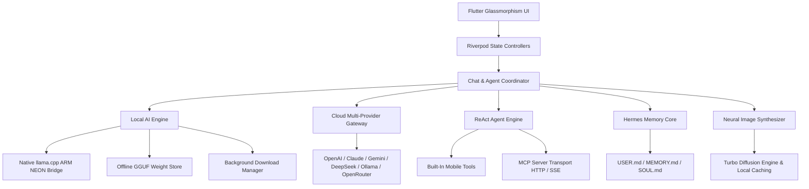

# 📱 PocketStrike

> **Executive Multi-Provider & 100% Offline AI Workstation for Android & Mobile**  
> *Bridge the gap between Cloud Frontier LLMs, Local On-Device GGUF Inference, Unlimited AI Image Synthesis, Model Context Protocol (MCP), and Self-Evolving Cross-Session Memory.*

[](https://flutter.dev)
[](https://dart.dev)
[](https://github.com/ggerganov/llama.cpp)
[](https://modelcontextprotocol.io)
[](LICENSE)

---

## 🌟 Key Features & Highlights

- ⚡ **100% Offline On-Device Native GGUF Inference**: Run state-of-the-art quantized SLMs locally on your phone using ARM NEON multi-threaded CPU acceleration. Zero cloud dependency, zero data leaving your device.
- 🔥 **Dedicated Uncensored & Standard SLM Suite**: Curated 1-tap presets including **SmolLM2 135M/360M Heretic**, **Llama 3.2 1B Abliterated**, **Qwen 2.5 0.5B**, **DeepSeek R1 Distill 1.5B**, and **Llama 3.2 3B**.
- ⚡ **Real-Time Token Generation Speed (`⚡ X.X tok/s`)**: Live generation throughput metric displayed dynamically in the bottom-right corner of the AI response container.
- 🎨 **Unlimited AI Image Generation Engine**: Create infinite images from natural language (`/image <prompt>`) with custom aspect ratios (`1:1`, `16:9`, `9:16`, `4:3`, `3:4`), interactive zoom/pan viewer, and 1-tap gallery downloads.
- 📥 **In-App Model Downloading with Live Notification Progress**: Download model weights straight from HuggingFace to your phone's storage with background Android notifications and 1-tap **"Load into RAM"**.
- 📐 **Adaptive Auto-Fitting Chat Layout**: User message bubbles automatically shrink-wrap to their content length (e.g., single-word prompts fit tightly without stretching).
- 🤖 **Autonomous ReAct Agent Engine**: Multi-step tool execution with step-by-step reasoning logs, real-time status chips, and configurable confirmation safety gates.
- 🔌 **Model Context Protocol (MCP) Marketplace**: Native Streamable HTTP & SSE transport support with 11+ built-in servers (Brave Search, GitHub, Puppeteer, PostgreSQL, Memory Graph, Hardware Specs, etc.).
- 🌌 **Hermes Self-Evolving Memory System**: Persistent `USER.md`, `MEMORY.md`, and `SOUL.md` files that autonomously learn your personality, preferences, and context across sessions.
- 📁 **Direct Mobile Storage Management**: File explorer and document tools to read, write, search, and manage files in `/storage/emulated/0/Download` and app documents.
- 🤖 **Telegram Autonomous Remote Relay**: Turn your phone into a 24/7 background AI assistant that receives prompts and replies over Telegram.
- 🎨 **Cyberpunk Glassmorphism UI**: Isolated backdrop blur, dark/light themes, syntax-highlighted code blocks, and haptic feedback.

---

## 🏗 Architecture Overview



---

## 🧠 Curated Local Model Suite

| Model Name | Parameters | Quantization | RAM Footprint | Category | Key Capability |
| :--- | :---: | :---: | :---: | :---: | :--- |
| **SmolLM2-135M-Instruct-heretic** | 135M | `Q4_K_M` | ~150 MB | 🔥 Uncensored | Ultra-compact, near-zero RAM footprint, zero alignment refusals |
| **SmolLM2-360M-Instruct-Heretic** | 360M | `Q4_K_M` | ~350 MB | 🔥 Uncensored | Balanced reasoning & instruction-following without guardrails |
| **Llama-3.2-1B-Abliterated** | 1.2B | `Q4_K_M` | ~950 MB | 🔥 Uncensored | Unrestricted creative writing, coding, and general assistance |
| **Qwen2.5-0.5B-Instruct** | 0.5B | `Q4_K_M` | ~450 MB | 💬 Standard | Multilingual instruction following & fast summaries |
| **Llama-3.2-1B-Instruct** | 1.2B | `Q4_K_M` | ~950 MB | 💬 Standard | Official Meta 1B model, high quality formatting & reasoning |
| **DeepSeek-R1-Distill-Qwen-1.5B** | 1.5B | `Q4_K_M` | ~1.3 GB | 💬 Standard | Distilled reasoning model with chain-of-thought output |
| **Llama-3.2-3B-Instruct** | 3.2B | `Q4_K_M` | ~2.1 GB | 💬 Standard | Comprehensive complex multi-step reasoning & coding |
| **SD-Turbo-Image-Gen** | Diffusion | `FP16` | ~1.8 GB | 🎨 Image Gen | Fast single-step local image generation |

---

## 🎨 Image Generation Commands

Generate images directly in any conversation using natural language:

```bash
# Square (1:1)
/image cyberpunk neon samurai meditating in rain

# Widescreen (16:9)
/image futuristic electric sports car speeding through tokyo 16:9

# Mobile Wallpaper (9:16)
/image breathtaking bioluminescent alien forest at night 9:16

# Natural Language Phrases
draw a cute fluffy orange cat wearing an astronaut helmet
generate an image of a medieval library filled with glowing crystals
```

---

## 🚀 Getting Started & Build Instructions

### Prerequisites
- **Flutter SDK**: `>= 3.29.0`
- **Dart SDK**: `>= 3.12.0`
- **Android SDK & NDK**: Installed with compileSdk 37, minSdk 26
- **Physical Android Device** (connected via USB/ADB) or Emulator

### 1. Clone & Setup Dependencies
```bash
git clone https://github.com/your-username/PocketStrike.git
cd PocketStrike
flutter pub get
```

### 2. Verify Code & Run Tests
```bash
# Static analysis (0 warnings / errors)
flutter analyze

# Unit & widget test suite
flutter test
```

### 3. Run in Debug Mode on Device
```bash
flutter run -d <device_id>
```

### 4. Build Final Production Release APK
```bash
flutter build apk --release
```
The optimized release APK will be generated at:
`build/app/outputs/flutter-apk/app-release.apk`

---

## 📁 Repository Structure

```
PocketStrike/
├── android/                    # Native Android configurations, ProGuard rules, & NDK bridges
├── lib/
│   ├── app/                    # Theme, Glass Tokens, & Router configuration
│   ├── core/                   # Drift SQLite Database, DAOs, Models, Notifications & Services
│   │   ├── db/                 # Drift tables & queries
│   │   ├── models/             # Provider-agnostic chat models & metrics
│   │   └── services/           # Android notification & background download service
│   ├── shared/                 # Glassmorphic UI components, code blocks & custom icons
│   └── features/
│       ├── agent/              # ReAct Agent Engine, Steps, & Built-in Tools
│       ├── chat/               # Chat UI shell, input bar, message cards & speed badges
│       ├── conversations/      # History drawer & thread management
│       ├── local_models/       # Native GGUF inference runtime, model downloader & presets
│       ├── mcp/                # MCP protocol client (Streamable HTTP & SSE) & marketplace
│       ├── providers/          # Multi-provider gateways (OpenAI, Claude, Gemini, DeepSeek, Ollama)
│       ├── settings/           # Local models, MCP, Storage, API keys, & Hermes memory UI
│       └── telegram/           # Telegram Bot autonomous background relay service
└── test/                       # Unit and widget test suite
```

---

## 🔒 Security & Sandboxing

- **On-Device Storage Control**: Configurable root directories in **Settings > Storage & Permissions**.
- **Human-in-the-Loop Safeguards**: Irreversible operations (`delete_file`, `overwrite_file`) require explicit confirmation depending on your chosen policy (`Destructive Only`, `Always Ask`, or `Autonomous`).
- **Hardware AES-256 Storage**: All cloud API keys and bot tokens are encrypted in hardware-backed platform storage via `flutter_secure_storage`.
- **R8 / ProGuard Safety**: Native JNI symbol preservation guarantees native model execution in release builds without runtime reflection crashes.

---

## 📄 License

PocketStrike is open-source software licensed under the **[MIT License](LICENSE)**.
